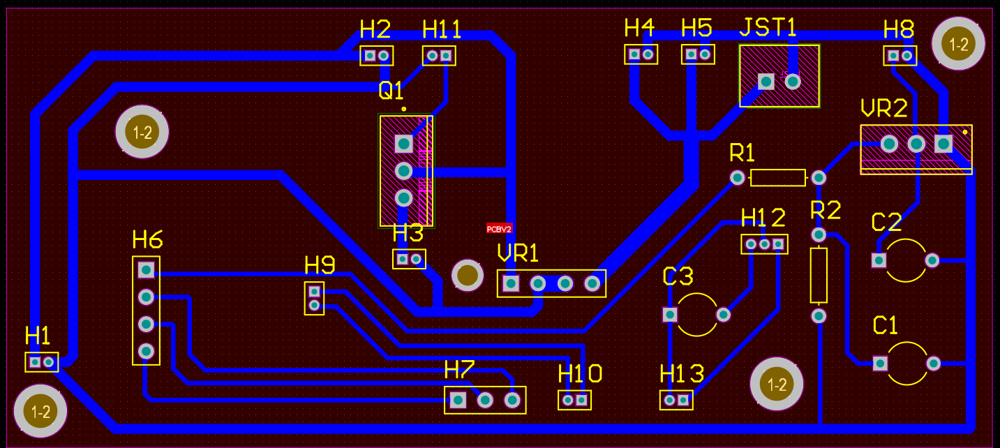
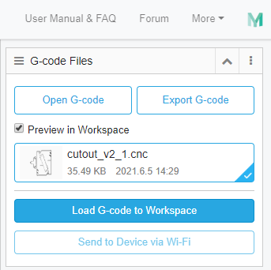
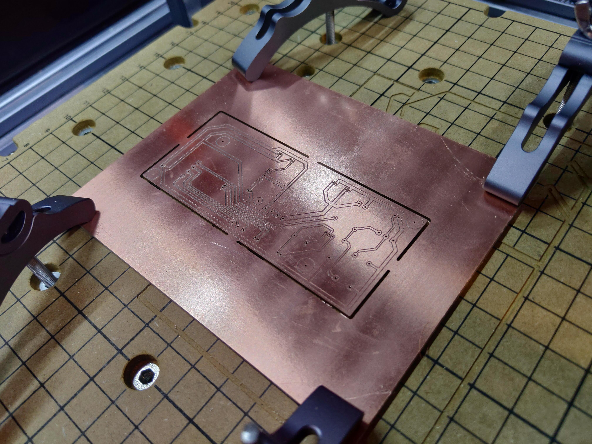

# Snapmaker 2.0 PCB Manufacturing Process

## Disclaimer
**USE THIS PROCESS AT YOUR OWN RISK.** It is a process I have developed for my own use, PCB milling on my Snapmaker 2.0 A250 **as a beginner at CNC milling with limited experience working in Altium Designer**. I am open to any additions or suggestions for improvement of this process, but this process is provided **as-is with no guarantee of support, warranty or compatibility with current or future hardware or software revisions.** This process worked for me, but there are no guarantees it will work for you. 

## Requirements
### Required Hardware
- Snapmaker 2.0 with CNC module & wasteboard. This process may work for other CNC mills too but it has not been tested as such. This process was tested on firmware (x.x.x)
- Snapmaker CNC bits and any bits required for the drilling portion of milling your PCB. In this example we use the Snapmaker V-Bit for isolation routing.

### Required Software
- Snapmaker Luban (tested on version 3.15.1) - sends the gcode to the mill.
- Altium Designer (for creating and exporting PCBs) - other software that can generate gerber and excellron files may also work - tested on version 21.0.9
- FlatCAM (FREE PCB manufacturing software) : http://flatcam.org/ - tested on version 8.994 Beta

### Useful Links
- All of the **CNC Gcode** used for my project (the cutout, drill and isolation routing) have been included in this project for troubleshooting purposes. 
- The tutorial video by **Garage Factory SD** which I used to learn the basics of Snapmaker PCB milling. This guide is a combination of what I learned from this video and my own experience: 
https://www.youtube.com/watch?v=1Ctp3FackBE
- The Specs of Snapmaker's CNC Bits
https://shop.snapmaker.com/products/cnc-bits-5-bits
- Download FlatCAM: http://flatcam.org/download
- I would recommend a simple script editor for working with the Gcode, such as Visual Studio Code, Atom or Sublime Text. Not necessary but can make reading the gcode easier.

 

## Part 1: Exporting Altium Designer PCB designs

In order to export a PCB design from altium designer, select the PCB design you would like to export, then go to `File -> fabrication outputs -> Gerber X2 Files`.

Do the same for NC drill files, using `File -> fabrication outputs -> NC Drill files`.

This will generate a Camtastic file visually showing the output. The files will be found in the following folder:

`Generated -> CAMtastic! Documents`

Right clicking on this and selecting **Explore** will open the location of these exported files in Explorer. Alternatively these can be found in the following folder:

`[Project Folder Name]/Project Outputs for [Project Folder Name]`

The files from this directory should be opened with **FlatCAM**.

### Example PCB Project

## Part 2: Generating CNC Jobs

### Opening Files
 - Open the bottom or top traces **Gerber** file using `File -> Open -> Open Gerber` in **FlatCAM**. The file will have a **.gbr** file extension.
 - Open your **NC Drill** file using `File -> Open -> Open Excellon` in **FlatCAM**. The file will have a **.txt** file extension.

### Generating Geometry

Make sure for each that only there are only **2** significant bits on all Gcode/CNC commands exported. This can be modified as a setting within **FlatCAM**. Below are the settings for each type of file to generate the correct CNC Gcode.

 

### Traces
Generate using **Isolation Routing** in **FlatCAM**.

Trace geometry should be generated with the following settings if using the Snapmaker V-bit.

    Diameter (tip): 0.2mm
    Length: 32mm
    Angle: 30 degrees

    Cut Depth: -0.2mm
    Travel-Z: 2
    Feedrate X-Y: 120
    Feedrate Z: 60
    Spindle Speed: 0

    End move Z: 15
    End move X/Y: None

### Drill
Generated using **Isolation Routing**. Drill parameters used in working final V1 power supply design mill, where a Gerber was used. Use NC drill files instead if possible.

    Diameter: 0.4mm

    Cut Depth: -1.8mm
    Multi-Depth: 0.6mm (ON)
    Travel-Z: 2
    Feedrate X-Y: 120
    Feedrate Z: 60
    Spindle Speed: 0

    End move Z: 15
    End move X/Y: None

### Cutout
Generate using the Cutout tool in **FlatCAM**

    Diameter: 0.8mm

    Cut Depth: -1.8mm
    Multi-Depth: 0.6mm (ON)
    Travel-Z: 2
    Feedrate X-Y: 120
    Feedrate Z: 60
    Spindle Speed: 0

## Part 3: Modifying CNC Gcode ready for use on the Snapmaker 2.0

> NOTE: the gcode .cnc files generated by FlatCAM are NOT valid .cnc files for the Snapmaker 2.0 by default, they need to be modified.

#### Step 1: Remove Auto-Generated Header
Remove everything in the FlatCAM gcode .cnc code up until the command `M03`. The following **MUST BE REMOVED**:

    (G-CODE GENERATED BY FLATCAM v8.994 - www.flatcam.org - Version Date: 2020/11/7)

    (Name: PCB1_Copper_Signal_Top.gbr_iso_combined_cnc)
    (Type: G-code from Geometry)
    (Units: MM)

    (Created on Tuesday, 19 January 2021 at 13:31)

    G01 F120.0

    M5
    G00 Z15.00
    G00 X0.00 Y0.00
    T1
    M6    
    (MSG, Change to Tool Dia = 0.4000)
    M0
    G00 Z15.00

#### Step 2: Insert Snapmaker 2.0 Header
In place of the auto-generated header, fill in the values in this template and paste it into the top of the generated gcode **.cnc** file.

> NOTE: Determining Min & Max X & Y is **IMPORTANT** because it is used to enable the `Run Boundary` feature on the Snapmaker 2.0, a crucial test to ensure the mill will not crash into the mounts.

    ;Header Start
    ;header_type: cnc
    ;renderMethod: line
    ;file_total_lines: INSERT_TOTAL_LINES_AFTER_PASTING_GCODE
    ;thumbnail: INSERT FULL ASCII ENCODED .PNG FILE HERE FOR THUMBNAIL ON MACHINE - a generic one can be found in the appendix. NOT REPLACING THIS TEXT WILL CAUSE THE SNAPMAKER TOUCHSCREEN TO CRASH.
    ;estimated_time(s): [Time in seconds. Insert your guess depending on the complexity of the job here (see appendix for more info). The machine will adjust based on progress through the program anyway.]
    ;max_x(mm): INSERT_MAX_X
    ;max_y(mm): INSERT_MAX_Y
    ;max_z(mm): 0
    ;min_x(mm): INSERT_MIN_X
    ;min_y(mm): INSERT_MIN_Y
    ;min_z(mm): 0
    ;work_speed(mm/minute): INSERT_WORK_SPEED
    ;jog_speed(mm/minute): INSERT_JOG_SPEED
    ;power(%): 0
    ;Header End

## Part 4: Send the data to the Snapmaker and start milling

Open the G-Code file you have just created in **Snapmaker Luban**. You can do this in the window shown below, in the top right corner of the software.

Snapmaker Luban will now show you a preview of this G-Code in the main window. Make sure everything looks good, and **Note the Location of your Work Origin relative to your milling position, It may NOT be in the centre**. Next connect to your snapmaker over WiFi and send this G-Code to it. Open the file on the printer and follow the guided process, and start your milling process!

> Make sure to first **set** your work origin high over your bed, then run the boundary check, making sure the cnc head or bit will not collide with any clamps or other items on your bed. Repeat this process at lower levels until you are 100% sure your head will not collide with anything. Once satisfied, set the work origin at the correct height using the calibration card, then start the milling process.

### Output after all 3 stages

## Appendix

#### Choosing Bits

I would recommend being very conservative with milling depths and speed to ensure you do not break your CNC bits. The V-bit is excellent for traces, but I would recommend aquiring drilling bits for the holes and a more accurate square end bit for cutting the board out than the bits included with the Snapmaker or the 5 CNC milling bits Snapmaker sells. As the collet is a standard size any bits that will fit in an ER-11 Collet should work.

#### Predicting Milling time

Milling a PCB only takes a few minutes, even if you are doing it quite slowly. Doing the traces on a 10cm or so 1-sided board only takes approximately 10 minutes with the V-bit, even at slower speeds. Every stage my milling process took approximately 10 minutes or so, not including swapping out the bits between stages.

#### Generic Thumbnail
If you would like to use a generic thumbnail to save time, here is the one from the example cnc gcode. This thumbnail is the thumbnail of the snapmaker tutorial object (the smartphone holder).

    data:image/png;base64,iVBORw0KGgoAAAANSUhEUgAAAtAAAAHgCAYAAACMxVqsAAAgAElEQVR4Xu3dTZbcNrK38byT3kbXRNtQTexltCfV29DI27AmV8twTVzb0KTuNjR53xOphgyxk5n8AEkA/PEcHckSCUQ8Een6JxgB/M+3b9/+38WFAAIIIIAAAggggAACkwj8DwE9iZObEEAAAQQQQAABBBC4EiCgJQICCCCAAAIIIIAAAjMIENAzYLkVAQQQQAABBBBAAAECWg4ggAACCCCAAAIIIDCDAAE9A5ZbEUAAAQQQQAABBBAgoOUAAggggAACCCCAAAIzCBDQM2C5FQEEEEAAAQQQQAABAloOIIAAAggggAACCCAwgwABPQOWWxFAAAEEEEAAAQQQIKDlAAIIIIAAAggggAACMwgQ0DNguRUBBBBAAAEEEEAAAQJaDiCAAAIIIIAAAgggMIMAAT0DllsRQAABBBBAAAEEECCg5QACCCCAAAIIIIAAAjMIENAzYLkVAQQQQAABBBBAAAECWg4ggAACCCCAAAIIIDCDAAE9A5ZbEUAAAQQQQAABBBAgoOUAAggggAACCCCAAAIzCBDQM2C5FQEEEEAAAQQQQAABAloOIIAAAggggAACCCAwgwABPQOWWxFAAAEEEEAAAQQQIKDlAAIIIIAAAggggAACMwgQ0DNguRUBBBBAAAEEEEAAAQJaDiCAAAIIIIAAAgggMIMAAT0DllsRQAABBBBAAAEEECCg5QACCCCAAAIIIIAAAjMIENAzYLkVAQQQQAABBBBAAAECWg4ggAACCCCAAAIIIDCDAAE9A5ZbEUAAAQQQQAABBBAgoOUAAggggAACCCCAAAIzCBDQM2C5FQEEEEAAAQQQQAABAloOIIAAAggggAACCCAwgwABPQOWWxFAAAEEEEAAAQQQIKDlAAIIIIAAAggggAACMwgQ0DNguRUBBBBAAAEEEEAAAQJaDiCAAAIIIIAAAgggMIMAAT0DllsRQAABBBBAAAEEECCg5QACCCCAAAIIIIAAAjMIENAzYLkVAQQQQAABBBBAAAECWg4ggAACCCCAAAIIIDCDAAE9A5ZbEUAAAQQQQAABBBAgoOUAAggggAACCCCAAAIzCBDQM2C5FQEEEEAAAQQQQAABAloOIIAAAggggAACCCAwgwABPQOWWxFAAAEEEEAAAQQQIKDlAAIIIIAAAggggAACMwgQ0DNguRUBBBBAAAEEEEAAAQJaDiCAAAIIIIAAAgggMIMAAT0DllsRQAABBBBAAAEEECCg5QACCCCAAAIIIIAAAjMIENAzYLkVAQQQQAABBBBAAAECWg4ggAACCCCAAAIIIDCDAAE9A5ZbEUAAAQQQQAABBBAgoOUAAggggAACCPwg8H//93/XP//zn/+8+3eQIXBmAgT0maPPdwQQQAABBDICIZ5///33q3j+9OnTj3+Jv4t/++OPP/BCAIHL5UJASwMEEEAAAQQQuBIIofzXX39dXl9ffxLP//u//3v5+vUrSggg8B8CBLRUQAABBBBAAIGreB4K5fjv+PsQ1HlJB1wInJ0AAX32DOA/AggggMDpCdwSysTz6dMCgDsECGjpgQACCCCAwIkJRG3zL7/8cq1vfn5+vpK49XcnRsR1BP6LAAEtKRBAAAEEEDgpgRDKLy8vl99+++36K4nn4d+dFA+3ERglQEBLDgQQQAABBE5IIK0yh3BOO27c+rsTouEyAg8JENAPEbkBAQQQqI9A1KfGLxcCSwmEWI5fHz9+/DHErb97NH6I71T68ehe/45ALwQI6F4iyQ8EEDgNgRDO//73v0/jL0frJhACPN/2rm5rWYdAGQIEdBmORkEAAQR2IZBesafT4naZ1CQI3CFAQEuPMxIgoM8YdT4jgECzBGJP3vjlQqAWAgR0LZFgx54ECOg9aZsLAQQQWEEgVp0/fPiwYgSPIlCeAAFdnqkR6ydAQNcfIxYigAACVwKxV+/b29v1z/nOCfAgsCeB4Zc4AnpP+uaqhQABXUsk2IEAAgjcIZA3DsaRyl+/fsULgUMI/OMf//hpXgL6kDCY9GACBPTBATA9Aggg8IjAsHEwToxLh148eta/I1CaAAFdmqjxWiRAQLcYNTYjgMBNAiE0//rrr+7EZWxZl/Z8tton+Y8mQEAfHQHz10CAgK4hCmxAAIEiBEI8//rrr5dv374VGa+GQfLGwSjdiNVnh1bUEJnz2kBAnzf2PP+bAAEtGxBAoCsC0eAUhzqE2Gz9CvH88vLyU+NgCGgXAkcSiM9Yvg+5tyJHRsPcRxEgoI8ib14EENiEQJQ7xA/0HmqENQ5ukiIGXUmAgF4J0ONdECCguwgjJxBAIBEI0RlbvbW+Ujvc8/nPP/9UuiHNqyAwR0BHHvfwNqgK8IyoigABXVU4GIMAAiUIRI1mbPPW8g9ujYMlMsEYWxAYCuixbRXjy2ycmtlLSdUWLI3ZLgECut3YsRwBBEYItF7GoXFQatdMYIqADuEcApp4rjmSbFtDgIBeQ8+zCCCwiED64bro4RsPffr06aea57TyVWr8qePESlwIhjXXsHEwfItfLgRqIZAL6JTz+dse4rmWSLFjSwIE9JZ0jY0AAjcJDLfBWospGgaHNc+l55hq49rSEY2DU0m77ygCSUATz0dFwLw1ECCga4gCGxA4GYEtxO1w7+fha+a9EK85JVDj4F5RMs8aAvHZiis/Tj5yN778xS/HzK+h69lWCBDQrUSKnQh0RGALAT3cpSJfyd0T3RoBrXFwz0iZaymBKNHIy4qI56UkPdcyAQK65eixHYFGCSQBHfs1Pz09Lfbi/f39x7NRxpHv/Rw/1OMHfX7P4okmPhjb5y2tWU6nKMZUt16NTzTBbQjsSiDV7MfnuPWtI3cFZ7LmCRDQzYeQAwi0RyAJ6KVis1aP49V2iPi5TX8aB2uNKLvuEUh5G78r25ArZyNAQJ8t4vxFoAICBPTPQdA4WEFSMmEWgRDNv/zyy/VI77F9oGcN6GYEGiNAQDcWMOYi0AMBAvrvKGoc7CGjz+VDLp7DcwL6XPHn7XcCBLRMQACB3QkQ0H8jzxsHb23Ht3twTIjAAwJ5zhLQ0uWsBAjos0ae3wgcSICA/g5f4+CBSWjqxQSidCMaZtNlBXoxSg82TICAbjh4TEegVQIE9OVaO/ry8vJDiPTWUNlqbrL7MQEC+jEjd/RPgIDuP8Y8RKA6AklA91ayMGcXDo2D1aXlKQyKrR3jzUd8YXt+fl7k81BAxyDDg4wWDewhBBoiQEA3FCymItALgVYEdKwSxz7SscdtvKZ+dE0V0BoHH5H071sQCPEcv9I1PHxo6pwE9FRS7uuZAAHdc3T5hkClBFoQ0EORm1AmIR2/54fAhNCeepBKLkB6W4WvNOVOb9ZQPCcgS0qHCOjTpxMAduGQAwggcASBFgT0LZEwhdUjQaJxcApF95QkMCae0xxxIujr6+vkKQnoyajc2DEBK9AdB5drCNRKoHYBndcnz2V4T0BrHJxL0/1rCUzN5XijEkdxT6mLJqDXRsXzPRAgoHuIIh8QaIxAzQJ6rHRjKuIQIVGWcevSODiVovtKEMhzOVaZo+QocvDedS9/03MEdInoGKN1AgR06xFkPwINEqhZQA/FQRIUIUbiilrn+HP67/R7rODFrzHxrHGwwURt2OThaYHhSuRnrDA/EtGP6vIJ6IYTg+nFCBDQxVAaCAEEphKoVUAPX3c/EhJT/Y37NA7OoeXetQSGpwXm40WZUb4bx6257tVFE9Bro+P5HggQ0D1EkQ8INEagRgE9XCEuebqaxsHGErQDc2NLxfR25JY78eUw7Rwz5u5YXTQB3UGCcGE1AQJ6NUIDIIDAXAK1Cehhc1/4s3SP3CGL4av0KTWmc3m6H4FbeZefdDm2yhwlHY9Wo4c5S0DLNwQuFwJaFiCAwO4EahPQ+QpxwChZupFvIVZyVXv3oJmwSQKPtmNcUhd9qzzESYRNpgejVxAgoFfA8ygCCCwjULOALily87KQOduELaPqKQRuE3i0D3Q8FavMIYzvXakumoCWaQhYgZYDCCBwAIHaBHQgSDaVKt2IMTUOHpBcprxJYPiW5dZNIZDjihM1x650Euewvvrr16+TjrsXHgR6IWAFupdI8gOBhgjUKKBjVS2aquacyHYPuT2fG0rIk5h6q9Z/6HqI6Cl10cPnCOiTJBE3fxAgoCUDAgjsTqBGAZ0EbwkhoHFw95Qy4QwCpeqi8ylLfG5muOBWBA4nQEAfHgIGIHA+AjUK6IhC2FWigVDj4PlyujWPp9RFx37R8cXy3nZ4yW8CurUMYO9aAgT0WoKeRwCB2QRqFdCpOWrNjgIaB2engwcOIlCyLjpKn1J99EHumBaBXQkQ0LviNhkCCKSV3vi9xGpvSaJJUKxpJMxrn2vzryQrY/VBYG1d9L0TC/sgxAsEbhMgoGUGAgjsTqDWFegAEfWhT09P1229llxJQJfcDm+JHZ5BYA6Be0d/xziRz/GFMB26kv47yjxcCJyRAAF9xqjzGYGDCdQsoNc2E6YSjhAWxMXBiWb6WQTytydjD6YjwOP3+OVC4KwECOizRp7fCBxIoGYBHVjCvjUCuFQz4oEhMvVJCUypi1aadNLk4PZPBAhoCYEAArsTqF1Ar20mTM/bmWD31DJhAQJT6qKVKBUAbYimCRDQTYeP8Qi0SaB2Ab22mTC9CrdS12Z+svo7gUdb3TmeXqacmQABfebo8x2BgwjULqADy9pmwg8fPlz3z12zJd5B4TEtAj8ITKmLXlPuBDUCrRIgoFuNHLsRaJhACwJ6bTNhKuNYsyVewyFmekcE8r3Nx9xSrtRRwLkyiQABPQmTmxBAoCSBFgR0+Bt2xnZ2S3cb0ExYMmuMdSSBR3XRvigeGR1zH0GAgD6CujkRODmBVgR0rCJHPXSsri25ogzk7e3tKsDjwImlQnzJ3J5BYAsCY3XRBPQWtI1ZMwECuubosA2BTgm0IqBLNRM6dKLTRD6pW7dENAF90mQ4sdsE9ImDz3UEjiLQioAOPtEM+Pz8vPhkwhZ8jdfzIfJdCEwhQEBPoeSe3gkQ0L1HmH8IVEigBVGZsJVqJowSjtfX112jEcI4rvf39+uOIOnX8O/iv21Jtmtomp6MgG46fIwvRICALgTSMAggMJ1ASwI6vFrTTJjKQLY8eCKEcYiaW8J4elQu1xrtaJp0IXCPAAEtPxC4XAhoWYAAArsTaE1ARzNhrOIuXUHeek/o1KxYIpC2IytBse8xCOi+48u7aQQI6Gmc3IUAAgUJtCagUxnH0kaptWUg99BP2aN3+Hyqd47fn56erv8cNsa1Ztu+giliqIoJENAVB4dpuxEgoHdDbSIEEEgEWhPQYXeJZsItVnfzk+KGwjj++9bf3crEtEq+ZamJT0AfBG6dTrj0y2UfRHhxRgIE9BmjzmcEDibQooBOomHp0dxb7XQR5Rsx9tK9qlMq5KKIGDr4A1L59AR05QFi3i4ECOhdMJsEAQRyAi0K6LB/TTPhFhmQyjdKNf+1Gpct2BpznAABLTsQ0EQoBxBA4AACrQq1tc2E6Tjkpc2Iw1CtPehlOF74l2qhtyg3OSDVTLkBgVsCWu38BqANWTUBK9BVh4dxCPRJoFUBvbaZsPQqdjRzhU1ryzdSluXCiCBq/7MXX9hi95g4CKjkRUCXpGmsVgkQ0K1Gjt0INEygVQEdyNc2E659Pg971D/HVWpFO/kXwuuIg18aTunqTI8Ypvr4aAyNHCl12iQBXV24GXQAAQL6AOimRODsBFoW0GkLr6XNhGnP5rUlEqn++dOnT5f4VerKtyjTTFiK6r7j3NpmruRJkwT0vvE0W50ECOg648IqBLom0LKAjsCsaSZM4mNtiUSJcpKxJGs9Pl1/eB44d0s854+U+MJFQJ85w/ieCBDQcgEBBHYn0LpAW1s6EWUcca2pXS61fd2t4OcnGy5dad89qUx4yY+NjzcUY9fa8hwCWrIhYBcOOYAAAgcQaF1Arz1ZMO12sbREovT2dcMU0Ex4wIdi5ZS3ap5fXl4ub29vN0deU9JBQK8Mlse7IGAFuoswcgKBtgi0LqCD9ppmwLRSuHT/5tLb193KnnQy4drVyrYys01r0/aIuVhOcXtU0rHkSxwB3WaesLosAQK6LE+jIYDABAI9COi0iry0xCGVSSx5vvT2dbdClu8JvURkTUgDtxQicEvQxtBp9434whXxHLvm1kUT0IUCZ5imCRDQTYeP8Qi0SaAHAR3kj2omXFuDPTVreonTVH9bvW9MQCcRHQ2rT09P17cmY9ecNw0EdKuZwu6SBAjokjSNhQACkwj0IsxCyIYwCYGy5AoOc4RLzLHV9nW37NdMuCSqxzyTynrurTJHyVCJumgC+pgYm7UuAgR0XfFgDQKnINCLgC7VTDhnT+gtt68bJp9mwrY+jrdqoXMPStVF3xLra7dlbIs0axGwC4ccQACBAwj0IqAD3ZpmwiRQ56xCb7l93a1U0Ex4wAdk5ZT5m4PhUKkuOo74/vXXX0dnulcXTUCvDJDHuyBgBbqLMHICgbYI9CSg1zYTzhGoW29fdyuL8mbCOSvlbWVkf9be230jbWEX5UfpC9ktAmNf7Ajo/vKFR/MJENDzmXkCAQRWEuhJQCdRu/QVdl4m8Whbuz22rxuGNvkXf//IvpVp4fHCBLaqi7417tydPAq7ajgEdidAQO+O3IQIINCTgI5orm0mzF+53yvn2GP7ulvZqZmw3c/sFnXRBHS7+cDycgQI6HIsjYQAAhMJ9Cag1zYTDkXOmIjea/u6YRg1E05M7Ipvy0txhmamko74+yl10QR0xYFm2m4ECOjdUJsIAQQSgd4EdPgVPq15jf1IRO+5fd2tTO0xZmf7RN7bLzpYxIE5U+qiI8+HQntN7p8tDvztgwAB3UcceYFAUwR6FGNrmwlTAPNyibQy+Pz8fNlz+7pbyaSZsKmP2Kixpeqi4wtdfhHQfeQHL6YTIKCns3InAggUItCjgC7Z4DfchiyEdLpiJ4wjrlx4aSY8IgLl5ixVF01Al4uJkdojQEC3FzMWI9A8gR4FdARlbTNhHthbe/kevcqnmbD5j95PDpSoi04DHp2bfUWGNy0QIKBbiBIbEeiMQK8Cem0z4TDM+V6+6QCMfDV677TQTLg38e3nm1oXfe8I8LCSgN4+VmaoiwABXVc8WIPAKQj0KqAjeOHb0j2hx4If5RNxRS300VfPsTua7VHzT6mLDoF8661IfKGLX58/f77+7kLgLAQI6LNEmp8IVESgZxFWqpmwonD9ZIpmwlojs86uJXXReZPrutk9jUB7BAjo9mLGYgSaJ9CzgC7ZTFhjoPPVSq/ta4zQOpumHAEeM7y9vV3LNlwInJUAAX3WyPMbgQMJ9CygA+uHDx+u5RZRytHjFf6lbcy+ffvWo4un9mlKXXQN5USnDhLnDydAQB8eAgYgcD4CvQvo0s2EtWVILrDi8A1iqrYIrbcnHdwzNpK3D+sZG6FtAgR02/FjPQJNEuhdQEdQtmgmrCnYZ4hhTbyPsGVqXfQRtpkTgaMJENBHR8D8CFRGIH5oxgrjx48fN1tZPIP4ima7qBc+6uCTrdNKM+HWhOsZf0pdtLcQ9cSLJfsQIKD34WwWBKonkIRz/LCMa8sO+zMI6KOP3t464ewJvTXhusZ/tNVdfFG0jV1dMWPNtgQI6G35Gh2BJgiMvardSkSfQUBH4DUTNpH+jJxIIP4/EXtBpwbS/DHHu0+E6LZuCBDQ3YSSIwjMJzBcdc5HCPEc/x6lHK+vr/MHv/PEWQR0WqXtdacKzYRFPxZNDDb2ZZuAbiJ8jCxIgIAuCNNQCLRE4N5qUojmOFksHd9buuP+LAI68kEzYUufCrZOIXBrhw4Cego59/REgIDuKZp8QWACgUerzvGDMB2QkP+gLFnjeCYBHc127+/vxVfxJ4R6l1s0E+6CuapJCOiqwsGYgwgQ0AeBNy0CRxCIRqAQPLdqGEM0h3geNgKl1/QlSznOJKDPtCd0HBwTOeTqmwAB3Xd8eTeNAAE9jZO7EGiawJxV51uORuNQHN1b6tCM3gV08I4vKyGeg1tcPYvLdDJhfPnqddu+pv8HUNh4ArowUMM1SYCAbjJsjEZgOoEQcbE13diqcyrXuDdi2sKqlEDqVUAHpy9fvlyF8/DqWUBrJpz+eezhTgK6hyjyYS0BAnotQc8jUCmBR6vOIejmHH6QDlMo0SzUm4AONiEib31JiS8dwexWeUylqbPIrN5iugjCSR4ioE8SaG7eJUBASxAEOiQwdnJYEnNTVp1vYUmv6teWcvQmtpI/iVlwji8n//rXv2Z9SWk5FVOZT/jQ67Z9LcenpO0EdEmaxmqVAAHdauTYjcANAmN7tMatIepiP+c1p4WlUo61DYW9Cej4YhFXiOZgc8ZGOicTnud/SQT0eWLN03ECBLTsQKADAo/KNfKt6da6m1Ya19T09iagU415MDnzld5QrP2CdWaGLfhOQLcQJTZuTYCA3pqw8RHYmMCSVecQwbFauqSUo8Te0L0J6Ahx+HSvdCHtzBH39rpCnZcOrS3z2fhjY/gVBAjoFfA82g0BArqbUHLkbATWrDon0R3MlhzTvXZv6B4FdKy+pr20Uy6mGA0bDNes3tee5z3Gtnbme9tHQO9N3Hw1EiCga4wKmxB4QGDKMdxTap3T7hFzd+QI89bsDd2jyEp7PoeIjj9HvXjaA3oYzhI7mdT6IdFMWGtkytlFQJdjaaR2CRDQ7caO5ScksGbVeQxXagycK+rW7A3do4AOvsPdOBLztPtJ1AZHDOM0yJJHo9f0UdBMWFM0trGFgN6Gq1HbIkBAtxUv1p6YwL1juFOT4JRV5xzhcLu7eH7OanQIwRBMseo6p566VwGdr77e28ou/J/LrKXU10zYUrTm20pAz2fmif4IEND9xZRHnRHYYtX50ZhzjmNesjd0rwI6cY2V5nuH1KQvHr3ul5z8i49iryvtnf1vZpY7BPQsXG7ulAAB3WlgudUHgRLHcA9JjNVPx4pp/Iq63TnbkCWxNOeZXgX01KxL5S+97lSRC6y5pUFTGbrvOAIE9HHszVwPAQK6nliwBIEfBB6tEM8ps0iDjo05PJ0wrShPLTFYstp4dgEdMYlyj6enp2vJTI+XZsIeo/rdJwK639jybDoBAno6K3cisAuBeyvESw9EGdsr+lbNcy58prx+zwX01BVVAvpyrR3XTLjLR8okhQkQ0IWBGq5JAgR0k2FjdM8Ebv1wWnMM97BRMLGLkovPnz//19HeaQU67puyXzEBvTwb44vEFMbLZzj2yZRLyjiOjUPp2Qno0kSN1yIBArrFqLG5awLDH05zaotzMFNLNoYwcwE9ZUWZgF6ejsEu6qHnNG0un23/J5eU9+xvpRnnEiCg5xJzf48ECOgeo8qnpgmUEND3ykDi5MF7290R0PulTyrjmPJFZT+rys2UmiVjRKvQ5bgePRIBfXQEzF8DAQK6hiiwAYEBgfxAjjkr0PeaD6c2BRLQ+6Zj8I4t7zQT7svdbMsJENDL2XmyHwIEdD+x5ElHBJYK6LwBMOEY7rLxCFM+95SVUSUcj4je//e0Ct3rntBOJlyXHzU+TUDXGBU27U2AgN6buPkQmEBgqYDOV49jmrFGwXsmENATAlT4lt6bCe26UjhhDh6OgD44AKavggABXUUYGIHAzwSWCui85nRO6Uc+ez63bez2ycxYxX9/f79EfXqPl2bCvqJKQPcVT94sI0BAL+PmKQQ2JbBUQIdR+bZ1U0owckeGPxgJ6E3D/GPw3veE1ky4Tx7tNQsBvRdp89RMgICuOTpsOy2BNQI6oKVa6Kh/nrNFGgF9XMppJjyOvZnnESCg5/Fyd58ECOg+48qrxgmsFdDxAy5WomNlM67USBh/jt04xq7hD8YpjW2aCMskW3pzMIV5mRn3HUUz4b68t5yNgN6SrrFbIUBAtxIpdp6KwFoBnWANhXT6+xDU8Su2T4ta6fg9LgL62DTTTHgsf7NPI0BAT+Pkrr4JENB9x5d3jRIoJaBz99Me0fF3UZP69vb2E50kqNOqdfzjlNVQK9DlkixKb56enrrdE1ozYblcOXIkAvpI+uauhQABXUsk2IFARmALAT0EHD8EY+eHENJjgnpK/TQBXS51z9RMOPVgn3J0jVSKAAFdiqRxWiZAQLccPbZ3S2APAX0LXvxgDDEdv+d10/dAE9Dr0zC9HQgBHX+esvvJ+lmPGSHfq3zKG45jrDTrPQIEtPxA4HIhoGUBAhUSOEpAL0FBQC+h9v2Z+LLy5cuXH82e8XdL9+9ebsW+T+bNhHO3WdzXUrONESCg5QYCBLQcQKBKAgR0lWEpYtRwtTkNGiv+Udbw22+/FZmn5kGcTFhzdB7bRkA/ZuSO/glYge4/xjxskAAB3WDQJpqcr9inMpl8J5SJwzR9m2bCpsP3X7v1hDfxxe+PP/5o2zHWIzCDAAE9A5ZbEdiLAAG9F+n95wnxGKUbZ1ltvkXYntD7513JGa1Al6RprFYJENCtRo7dXRMgoPsNbxKPZ2+g00zYbo4T0O3GjuXlCBDQ5VgaCYFiBAjoYiirHCjE45lXoCMomgmrTM3JRuX/j4qHlHBMRufGTggQ0J0Ekht9ESCg+4rn0Jso44jr7DWjmgnbzXMCut3YsbwMAQK6DEejIFCUAAFdFGd1g6VX4D3v9zwFumbCKZTqvIeArjMurNqPAAG9H2szITCZQP7DKXZqmHIi4OTBC9/4+++/X+JXXFP39bXyeLnEsd3x2vsM29aNpZxmwsIfxh2HI6B3hG2qKgkQ0FWGhVFnJ0BA958BIR7ji0fNX472iEJqJqz9i+IeLFqag4BuKVps3YIAAb0FVWMisJIAAb0SYCOPR5ynrto34tJsM5e8wZg9iQeKEyCgiyM1YGMECOjGAsbccxAgoM8RZ82E3+OspKe9fCeg24sZi8sSIKDL8jQaApUFrB0AACAASURBVEUItCqgY1eJKTW9BNP3NLEn9HcOUQ/+9vZ2/fPZ98cu8j+QHQYhoHeAbIqqCRDQVYeHcWclQECfJ/L2hP55T+ipX8LOkyF1ekpA1xkXVu1HgIDej7WZEJhMgICejKr5G6eWccTWd9Fo1+uVmgk/fvx4eX197dXNbvwioLsJJUcWEiCgF4LzGAJbEiCgt6Rb19j39oSOf4syj/gVf+5ZXOZ7Qp+9sbKuDL1tDQHdQpTYuCUBAnpLusZGYCEBAnohuEYfy/eEDqH8119/XUVzqguOlef4Ff/ds7hUG99OAhPQ7cSKpdsQIKC34WpUBFYRIKBX4Wvu4bQndBLJ4UD8+fn5+brqnBozo8wh/q7XI8A1E7aTugR0O7Fi6TYECOhtuBoVgVUECOhV+Jp8OMU8hPOnT59u7mbS+64dPZ9MGG8W3t/fr28R4s+tXxGr/Ioveb1+sWs9VuzfhgABvQ1XoyKwikBqqEorkTWfVpcfhDF1BwWv6m+nx5RGwWA3lfOqJDzo4R6bCaMk59dffz2I6HbTprck6UvfdjMZGYH6CBDQ9cWERQhcCGhJMEYgmu1iJbPXnSryZsL44tjDziO5TxHXmr8QT/3k9RCXqb66D4FbBAhoeYFAhQQI6AqDUolJqcyh12bCtCtJ4O6lLGAooB0WU8mHiRkIrCBAQK+A51EEtiJAQG9Fto9xNRO2FcehgO6xVnjKCaRtRY21CNwnQEDLEAQqJEBAVxiUikzSTFhRMCaYMhTQEx5p7pZe3hY0B57BhxEgoA9Db2IExgkQ0LLjEYHemwl7azSNRsKermFTJAHdU3T5MoUAAT2FknsQ2JkAAb0z8Aaniz2T49JM2GDwOjDZPtAdBJELqwgQ0KvweRiBbQgQ0Ntw7WnUVMbRy04Vw9jkW79Z3awvcwno+mLCon0JEND78jYbApMIENCTMJ3+Js2Ep0+BwwAQ0IehN3ElBAjoSgLBjDYIpBPESu+Bmp9MFnv8RtNRPlfN+8Y6SOW43E3se90WreeTCY/LmjIzE9BlOBqlXQIEdLuxY/kBBOIHeoiWdGJcOokrTMlFdRK/Q2GcTL7172PuxLgE9AHBbmRKzYSNBKozMwnozgLKndkECOjZyDxwFgIhcqMOM0TzPcEbAjdqNOPet7e3UTy5wE5/fnp6+nF/+rvhfXFP6RXvkjG0Al2S5vyxopkwcqTHvYWDRo8nE86Pcn1PEND1xYRF+xIgoPflbbZGCIRgDmGSryCH6R8/fryKlXzFOf7u+fn5h2fDZ2oWvyXCQUCXoLh8DM2Ey9l5cjkBAno5O0/2QYCA7iOOvChIYEw8f/r06RK/XD8TIKCPzwjNhMfH4GwWENBnizh/hwQIaDmBQEYgF4Ppr1OJBvF8O1UI6OM/QqnM4QzNhH/++edPb3yOp39OCwjoc8ad138TIKBlAwKXy7VUIzUI5kBCPMdBFb2XYaxJAgJ6Db1yz2omLMfSSI8JENCPGbmjbwIEdN/x5d0EAiGeQwSGgB6K55p3v5jg2i63ENC7YH44iWbCh4jcUJAAAV0QpqGaJEBANxk2RpcioN55PUkCej3DEiOcqZlQP0KJjFk3BgG9jp+n2ydAQLcfQx4sJJAfFZyGUO88H+aSwy7SD19HNM/nfe+J3psJ8xM6e633LpsR241GQG/H1shtECCg24gTKwsTGGsWVO88HzQBPZ/ZVk9oJtyKrHGHBAhoOXF2AgT02TPgZP5rFiwfcAK6PNOlI6a3KnGoSqzu93h5e1FHVAnoOuLAiuMIENDHsTfzzgTUO28DnIDehuvSUTUTLiXnuTkECOg5tNzbIwECuseo8um/CNwSz+qdyyRKLqCnNndZRSzD/tYovTcTLvnCth3t845MQJ839jz/ToCAlgndExirdw6x1+tr7j2DSkDvSXvaXCFupn6ZmTZiXXelZsL4EmyryWNiQ0Afw92s9RAgoOuJBUsKE1DvXBjoyHAE9D6c58yimXAOLfcuIUBAL6HmmZ4IENA9RZMvPwiEeH55ebm8vb39ROXjx4/XkwVd5QgQ0OVYlhopNRP2fOy1MqBS2bJsHAJ6GTdP9UOAgO4nljz5DwHNgvumAgG9L++ps2kmnErKfUsIENBLqHmmJwIEdE/R5Mv1SO74lV+aBbdNDAJ6W75LR9dMuJSc56YQIKCnUHJPzwQI6J6jeyLf1DsfF2wC+jj2j2YOkdPzntCpmVBp1qNMKP/vBHR5pkZsiwAB3Va8WHuDAPF8bFoQ0Mfyvzd7782E+Runnuu9a8wwArrGqLBpTwIE9J60zVWcgHrn4khnD0hAz0a22wOaCXdDfbqJCOjThZzDAwIEtJRolkASB7kD6p33DycBvT/zOTNGmcPz8/O1lKPHK5ol0247375969HFKn0ioKsMC6N2JEBA7wjbVOUIxMpzCIPhFYcqhIh27UeAgN6P9ZKZNBMuoeaZRwQI6EeE/HvvBAjo3iPcsX/5ylNyUzPR/gEnoPdnPndGzYRzibn/EQEC+hEh/947AQK69wh37t/YtnXxujpeW7u2J0BAb8947QzRTBglT70ee52aJYOTZsK12TLteQJ6Gid39UuAgO43tqfx7FYttB+k+4WfgN6P9dKZUox6FpdOJlyaHcueI6CXcfNUPwQI6H5ieWpPxmqiP336dIlfru0IENDbsS05smbCkjSNRUDLgbMTIKDPngEd+R8i+uXl5UdHfnLtt99+63YHghrCR0DXEIXHNqQ49bpTRZ6HPR8e8zjS+9xBQO/D2Sz1EiCg640NyxYS0Fy4ENzCxwjoheAOeEwz4QHQO52SgO40sNyaTICAnozKjS0R0Fy4X7QI6P1Yr50pmu3e398vr6+va4eq8vm8mdCWltuGiIDelq/R6ydAQNcfIxYuJKC5cCG4mY8R0DOBHXh7782EeS+E0q1tE42A3pav0esnQEDXHyMWriAwJqI1F66AOniUgC7Hco+RNBPuQbn/OQjo/mPMw/sECGgZ0j0BzYXbhpiA3pZv6dE1E5Ymes7xCOhzxp3XfxMgoGXDaQhoLtwm1AT0Nly3HLX3ZkJ7Qm+ZPd/HJqC3Z2yGugkQ0HXHh3WFCWguLAz0crkQ0OWZbj2iZsKtCfc/PgHdf4x5eJ8AAS1DTkcgF3zJ+X/+85/XvaId/z0/HQjo+cyOfqL3ZsK890Ez4TbZRkBvw9Wo7RAgoNuJFUsLEhhrLnQAw3zIBPR8ZjU8oZmwhii0awMB3W7sWF6GAAFdhqNRGiSgubBM0PIvI1N3N1GjWob9mlFSOZOTCddQPO+zBPR5Y8/z7wQIaJlwegKaC9elAAG9jt+RT2smPJJ+23MT0G3Hj/XrCRDQ6xkaoQMCY82FcWJb1Ee7xgkQ0O1mR3x5jMvJhO3G8CjLCeijyJu3FgIEdC2RYMfhBDQXLgvBkoYtJRzLWJd+KuV8r8deL/lyV5pxr+MR0L1Gll9TCRDQU0m57xQENBfODzMBPZ9ZTU/03kwY/kW/Q1y91nsfkU8E9BHUzVkTAQK6pmiwpQoCY82FUxvkqnBiRyMI6B1hbzBV7AkdK9G9isv8zdKff/5pq8pCOURAFwJpmGYJENDNho7hWxIYE9H5nMPa6Py/n56eftx6777hv6XnWqq7XiKg06qgPXq3zOLpY2smnM7Knd8JENAy4ewECOizZwD/7xIIcRhiOr0CTjfn//3+/v5jjPzvh88sRf3x48fL58+fq21mJKCXRrae56KZML68xT7oPV5plT1867Xee++4EdB7EzdfbQQI6Noiwp4uCQzF9CPRHaL07e3tB4uaf+gT0O2nbO/NhHkZh8OSyuQrAV2Go1HaJUBAtxs7lndMIF8xq33VjIDuIxE1E/YRx728IKD3Im2eWgkQ0LVGhl2nJkBAnzr8hzivmfAQ7M1OSkA3GzqGFyJAQBcCaRgEShJoSUBHeUqsQkfj4/Pz8yQMmggnYdr1pohjxKXnEgf7j5dLKQK6HEsjtUmAgG4zbqzunEBLAnpJKAjoJdS2f0Yz4faMe5mBgO4lkvxYSoCAXkrOcwhsSICA3hCuoUcJaCaUHFMJENBTSbmvVwIEdK+R5VfTBAjopsPXtPEhjHo+NCi9/YiSo9jdxrWMAAG9jJun+iFAQPcTS550RKAlAZ1qoGPbvdizOg5HeXQp4XhE6Lh/10x4HPuWZiagW4oWW7cgQEBvQdWYCKwk0IKADuEcr/x///33H95OPVmQgF6ZIBs+nrYl7PnYa82E6xOIgF7P0AhtEyCg244f6zslULuADvtCaIVgjlfh8d9xEdB9JGTvzYThXzqo6Nu3b30EbWcvCOidgZuuOgIEdHUhYRACl6sgjdXddNV2EmGsPodwjstBKv1lrGbC/mJa2iMCujRR47VGgIBuLWLsPQWB2gV0HgQCus+UDIHU857QqYwo6vZfX1/7DOKGXhHQG8I1dBMECOgmwsTIsxEgoM8W8fr87b2ZMGr3U/1+z/XeW2UWAb0VWeO2QoCAbiVS7DwVAQL6VOGu0lnNhFWGpRqjCOhqQsGQgwgQ0AeBNy0C9wgMBXTNK2TpCOjwRxPh96gGk5eXl+aTPG1N2GuJg2bC5SlKQC9n58k+CBDQfcSRF50RIKDbDmguzNr25Lv1vdZCp2bJnn3cKv8I6K3IGrcVAgR0K5Fi56kIENBthzsEdFyfP39e5Eja4WTRw4UfitX08CdE9PPzc+HRjx9OM+GyGBDQy7h5qh8CBHQ/seRJRwRaFdBTdzTo/SCV3vZRDhEdV03CvtTHPf+s1bZdZCkftxiHgN6CqjFbIkBAtxQttp6GAAHddqh7K+EI4RzissfrUQ1//Hvs1hHlHlHjP/W4+h5Z5T4R0L1HmH+PCBDQjwj5dwQOIEBAHwC94JTDI84LDn3IUCEip75dOMTAlZMOmwnTMfURx7T6nk8xtVl2pVlVPz4U0D3nR9WBYNxhBAjow9CbGIFxAgS07KiJQGq261Uk5c2Esdp+SzQP//7s5R4EdE2fULYcQYCAPoK6ORF4QICAliK1EQjB1PPK662ymxDNqWwjGijt2vF3VhLQtX1C2bM3AQJ6b+LmQ2ACAQJ6AiS37EogcvL9/b3rY69TvXOA/de//nVz15EkHHuuC5+SWAT0FEru6ZkAAd1zdPnWLAECutnQdWt4Wn09e+lCvlJd8wFHWyciAb01YePXToCArj1C7DslAQL6lGGv3unYfjBKGWJP6LNeeRlHzyUtj+JLQD8i5N97J0BA9x5h/jVJgIBuMmzdGx3bucWvb9++de/rPQdz8XhWFgT0qT8CnL9cLgS0NECgQgJJqCTTan5VnO+jO3WXht4PUqkwpYqZFMKp16O9p0LKv+DW/Nmc6s+S+wjoJdQ80xMBArqnaPKlGwIEdDeh7M6R3k5ZXBIgZRyXCwG9JHM80xMBArqnaPKlGwIEdDeh7M4RzYTfQ5reosSfz1jGQUB399Hm0EwCBPRMYG5HYA8CRwrodIhEbNM15VLCMYVSX/doJrxc8jKOM5a0ENB9faZ5M58AAT2fmScQ2JzAXgI6ieW//vrr8vb2dt3nN36Pa+oOAwT05ulQ3QRJPJ5x5TUFIz4zv/7666zPSnWBXGEQAb0Cnke7IEBAdxFGTvRGYAsBHUI3BHL8PhTLt/hNbQgkoHvLvmn+aCb8uYzjbPtjE9DTPifu6pcAAd1vbHnWMIFSAjqdrJavLCcsUaIRv9KKczq2OOaOa+pJawR0w4m2wnTNhJdTH+1NQK/48Hi0CwIEdBdh5ERvBNYK6BC10eyVi+EQxE9PT5dYWY7DMOK/4zV0vI7/9OnTtWQj312AgO4tq8r6c/ZmwuFnbOobm7JROG40Avo49maugwABXUccWIHATwTWCOj4wf7y8nJdWQ4R/Pr6ev19ypXXdRLQU4id+54zNhMOhXP+RmfOZ631zCGgW48g+9cSIKDXEvQ8AhsQWCOg07MhgGN3gFhtnnoR0FNJuS8InKmZMJVDxcr78ErlT/Em5ywXAX2WSPNzjAABLTcQqJDAUgG99oAHArrCZKjYpJQvPW/jlr/RIZz/JkBAV/zBZNouBAjoXTCbBIF5BJYK6OEPtVgRm7MqRkDPi5O7L5femwnzL6Up3rHinPoGzpoDBPRZI8/vRICAlgsIVEhgqYDOT0dLbs1pbloioGOe9MN06lzJzql7TVcYIib9h0DvzYTDxtq5ZVG9JgoB3Wtk+TWVAAE9lZT7ENiRwFIBPfa6eWo9dC6gw92pB2UQ0DsmR4VTRfznvu2o0I1Rk9IXvqlfEFvybamtBPRScp7rhQAB3Usk+dEVgaUCOkEYPp/+/pHIIaC7SqPdnOm9mTD/PP3555+zGnN3C8LOExHQOwM3XXUECOjqQsIgBC7X/ZvTHs7BY8kP7aEYTlzvraLlh6JYgZaJUwmkXFuSp1PnOPq+JBiVHX2PBAF9dEaa/2gCBPTRETA/AjcIlBDQMezcko61Anrq3tFqoPtL+96bCcO/dGrn1NKm/qL8t0cEdM/R5dsUAgT0FEruQWBnAkMBPbWGeczMqSUduYCeKobz1ahHJSLJPgJ654TaYbozNRP2vG3f1FQhoKeScl+vBAjoXiPLr6YJjAneNa+Px0o68jFzAT1VDKdn5px6SEA3nZ6jxoeo6llcaia0At3nJ5dXSwgQ0EuoeQaBHQikxqzhVGtOPXtU0vHly5dLrCTOEerp1fYc4URA75BAB0zRezNh/pn8+vXrJT6LZ72sQJ818vxOBAhouYBAxQRi1Th+aIfwvSWkl+5JO7bCHXPMKd1Ir+3nPBNzENAVJ90K03pvJszf0Mz5krkCabWPEtDVhoZhOxEgoHcCbRoE1hC4J3hjV43Pnz/PXg27VdIxpwwjxESsPsfvc3dfIKDXZEPdz0Zsn5+fr6UcPV6aCb9HlYDuMbv5NIcAAT2HlnsROJBACNVY8c23t8vNmVqznD+Tl3TMfT6J+iUrcQT0gYm08dSaCTcGXMnwBHQlgWDGYQQI6MPQmxiBZQTG6phjtFhBDiEconbOFWPOqedc0jiY20NAz4lOe/f23kxoT2gr0O19KllcmgABXZqo8RDYicAWZR1TTV/SOEhAT6Xb/n1Rtx8lQtFo1+OlmZCA7jGv+TSPAAE9j5e7EaiKwBZlHY8cXNo4SEA/ItvPv6ccmVsb3wqBvH9gSQlTK37es1MJRw9R5MMaAgT0GnqeRaASAo/KOuKHfJR2rL3WNA4S0Gvpt/W8ZsK24jXXWgJ6LjH390aAgO4tovw5NYGxw1ICytrTDGOMNY2DBPS5UjOtQvd67HXyL6I6Zw/0XrKAgO4lkvxYSoCAXkrOcwhUTOBeffTc3TaSm2sbBwnoihNmI9M0E16u2zy+v79ft/br6SKge4omX5YQIKCXUPMMAg0QKF3WkRoHlwpwArqBpClsYjTbhXh8fX0tPHIdw401E8ZnL94GxSr129vb1dgSn5s6vP5uBQFdUzTYcgQBAvoI6uZEYEcCJU4zTKUhc08cHHPTNnY7JsCBU/XeTDgs44jPx5cvX67C+dZVoozqwHD+NDUBXUsk2HEUAQL6KPLmRWBnAvfKOu7tJFCqcdAK9M4Br2S63psJ05fBqbjj5NAeVuQJ6KkRd1+vBAjoXiPLLwRuEAgxHEJ6bIXs1mvmUo2DBPQ5U7L3ZsJHjbtR+/yvf/3rEuUe8fmLK/bHnnNwUY2ZQ0DXGBU27UmAgN6TtrkQqIRAvqo8NCl/zVyycZCAriT4B5jRezNhIE09AvH5CdEcK835iaB5uUcPe0cT0Ad8kExZFQECuqpwMAaBfQk8Os0wrIkmqNINUGqg943z0bOFuIyrh9KFeyzjC+e9leVcdLa+vR8BffSnyvxHEyCgj46A+RE4mMCj0wxLNQ5agT440AdOn1ZfeyhdWILx1mes9VMaCeglmeCZnggQ0D1Fky8IrCBwa9u7EM+xali6XtMK9IpANfpo782Ew7Dc2souv6f1Mg4CutEPIrOLESCgi6E0EAJ9EEhNhkk8b+FVEtC97EiwBaPexkx7JrdeunAvLkk0R9nTWKNuep6A7i3D+XM2AgT02SLOXwQmEHhUyzlhiLu3ENBrCbb5fO/NhKmRcCw6qcEwduVo/WRCK9BtfgZZXY4AAV2OpZEQQGAiAQJ6IqjObguB+fT0dPnjjz868+y7O7cEdIjm+BUrzvmuHK0DIKBbjyD71xIgoNcS9DwCCMwmQEDPRtbFA703E+Zb1eWiuXQPQQ3JQEDXEAU2HEmAgD6SvrkROCkBAvqkgb9cLr03E54ltwno836Gef6dAAEtExBAYHcCZxEZu4NtYMLemwmTfxGKnrftI6Ab+LAxcVMCBPSmeA2OAAK3CCQBHf/W+n64IjyPQDrdMuqge6oJThSSf/Hfre+0cS+yBPS8vHd3fwQI6P5iyiMEqieQC2giuvpwFTfwTM2EvW7bR0AX/1gYsDECBHRjAWMuAj0QuLVbQenjwnvg1KsPZ2om7HWlnYDu9dPJr6kECOippNyHAALFCNw69TAGd7BKMcTVD9R7M2ESmL2WcRDQ1X/EGLgxAQJ6Y8CGRwCBcQJj++bGql3rB02I+30CmgnbzhACuu34sX49AQJ6PUMjIIDACgJxdHj8Gl6aC1dAbeDRv/766/Lrr79220Sa/ItQ9LgKTUA38CFj4qYECOhN8RocAQSmEMjFRn6/uugp9Nq9RzNhu7EjoNuNHcvLECCgy3A0CgIILCAQwjmVaqiLXgCw8Uc0E7YbQAK63dixvAwBAroMR6MggMBMAkk8DRsH84Mo0pBxFLK66JmAG7k9hFjPbxp6bSYkoBv5gDFzMwIE9GZoDYwAAmME8sMm4p4QyK+vr9ff40rievh8r1uCnTlTNBO2GX0Cus24sbocAQK6HEsjIYDARAJTdt8Yq4vusSFrIrYub6ulmTDs+PLly+X9/f1aVhSr4iWuXpsJCegS2WGMlgkQ0C1Hj+0INErgloBOruSv89VFNxrgmWYf3UwYeRY2xO/pKlk2lOd7LycTEtAzk9zt3REgoLsLKYcQqJ9AEhQhUnLRkixXF11/DEtaeHQz4VjJUPhYomwoH7+X7RkJ6JKfAGO1SICAbjFqbEagcQK5gI7a55eXl8vb29tPXg1XANVFNx70B+aHICshVpdQGr4RiTKhyL/IufiCV8Ku3poJCeglmeaZnggQ0D1Fky8INEIgF9Bfv369Wj1W1pGv2KmLbiTAC8yMZsKIb8qHBUMseuRWQ2tuQzroZ+3Kcb67TIyfGmYXGV3BQwR0BUFgwqEECOhD8ZscgXMSuCWgg8TYqYTqovvPk6OaCYdvNm6tNpewLf/yV2JF++iMIKCPjoD5jyZAQB8dAfMjcEICYwI6UIytMg/rom+J7ZKNXycMy+Euf/jw4boDRgjMva78zUfkz9gKeAkRHf6lmv/WmwkJ6L0y1Dy1EiCga40MuxDomMA9AR1uj+2+oS6646TI9v/eq8RhWL4x/JI2pL1WRPfUTEhA9/1Z5N1jAgT0Y0buQACBwgQeCeg03a1TCePf8nrUoQhKz9ovunDQdhpuz2bC4duOKaUVKXeX1kT30kxIQO/0gTBNtQQI6GpDwzAE+iUwVUAHgbHdN6bURd97Jd8v3bY9iy9NcZhJ7M6y9TVsXJ0iilM+Ls2tXpoJCeits9P4tRMgoGuPEPsQ6JDAHAEd7quL7jAJRlxKAnWKmF1LZWr983CeVMs8ZcV6+Gz+hXDJ82t9LvU8AV2KpHFaJUBAtxo5diPQMIG5AjpcXVsXna9YN4zuFKbv0Uw4LP2Zkx9pFflRzfRYsJIAX7qKXUMSENA1RIENRxIgoI+kb24ETkogCZAlAmJqXfTwaOZArS66jYRLq7Rb7lQxLA2as+KdvxGZ81yi30MzIQHdxmeJldsRIKC3Y2tkBBAYIbBGQMeQa+qi99rhQfDXEdi6mXBp+UbyKj2/9EtZ682EBPS6/PZ0+wQI6PZjyAMEmiOQryIvXWVcUhe9ZMW7ObidGLxlM+Hc7etuIc2/xC3J4dabCQnoTj5o3FhMgIBejM6DCCCwlEAJAR1zT62LToeuLF0tXOqn55YT2LKZcPjla079c+5REpFLmgFbbyYkoJfntif7IEBA9xFHXiDQFIFSAjo5fa8u+unp6RJNW04pbCpFrsZu1Uw4PMVySR1z2JfybukXs9RMuLQZ8ciIEtBH0jd3DQQI6BqiwAYETkagtIAOfGN10SGcY6V66SrjyUJTlbtJ6C4pkbjnyNr65zR2nnNLautzIb9UxB8VMAL6KPLmrYUAAV1LJNiBwIkIbCGgA99YXfTSFcIThaRaV0s3E5aof85hpVXkpTnWajMhAV3tR4ZhOxEgoHcCbRoEEPibwFYCOmYY1kVrHGw782K1OK5SJxMOv2StXfld20yYr4aXXmnfMvIE9JZ0jd0CAQK6hSixEYHOCGwpoBOqeD0eYunz58/X+mdXmwSSQF1SInHL41L1z/nYSQQvEeOtNhMS0G1+nlhdjgABXY6lkRBAYCKBPQT0RFPc1gCBks2Epeqfh9hi3GhYjR055l4tNhMS0HOj7P7eCBDQvUWUPwg0QICAbiBIFZmY8mVticOw/nlp3fIYmhh/yduO/POwZBX7iFAR0EdQN2dNBAjomqLBFgROQoCAPkmgC7pZopmwdP1zQfcurTUTEtAlo2+sFgkQ0C1Gjc0INE6AgG48gAeYP7VEIlaB43p/f782lMb19vZ2/T0EdPq7+O+1K9o5hqhljl9Lmx1bayYkoA/4EJiyKgIEdFXhYAwC5yBAQJ8jziW9TM12eY1xEsZJLOfi+NHcpXdnSavbSw9Faa2ZkIB+lGH+vXcCBHTvEeYfAhUSyHdCKLkKWKGrTCpIIDXblRiydP1z2JRWkZce2tNSMyEBXSILjdEyAQK65eixHYFGCRDQjQbuYLPHQXoadgAADl1JREFUTpuca1asPkepxZKGv3tz5fYtaQbM38yU2rZvLpup9xPQU0m5r1cCBHSvkeUXAhUTyAV07UKhYoynNC2vFb4FIIni+D22lYsryiriSn9XWjjnduTCcq6IzncJ2WKFvGTCENAlaRqrRQIEdItRYzMCjRMgoBsP4IHmh8iMld74fU9hPNXlfBU5npkroltpJiSgp2aE+3olQED3Gll+IVAxAQK64uAwbRWBfKu8aHiMXI+3LFOvVpoJCeipEXVfrwQI6F4jyy8EKiaQC+iluxZU7B7TTk4gNQNGGUaUi4SonrO9XQt7QhPQJ09y7l8IaEmAAAK7E8gFdEweIiNW656fn3e3xYQIlCaQryLHLjNR1hFfFENQT7laaCYkoKdE0j09EyCge44u3xColMBQQCczQ0RPFRmVusYsBK4EksBcktN5GUitzYQEtEQ/OwEC+uwZwH8EDiAwPFI5N6FWwXAAJlM2TCCtIi/N59qbCQnohpOT6UUIENBFMBoEAQTmEohdFF5eXn4cs5w/ry56Lk3310YgL+NYslVj7c2EBHRtGceevQkQ0HsTNx8CCPxEYGxfX3XREqV1AqmZcEkZR/heczMhAd16drJ/LQECei1BzyOAwGoCYzXRMfBS8bHaKAMgsJJA3gy45Mj6mpsJCeiVyeHx5gkQ0M2HkAMItEsgXlPHSnPsvqEuut04svw2gVwAzz1QJUbMPxOfPn26xK9aLgK6lkiw4ygCBPRR5M2LwMkJ5McWJ3Fwry46hPacAylOjpf7BxPI8ztMWdpMmMpAYowlq9hbYSCgtyJr3FYIENCtRIqdCHRGYHjkcd44qC66s2Cf0J1bObxEAOfNhEtWsbdCT0BvRda4rRAgoFuJFDsR6IjAcHUuuZY3Dt6ri67tdXZHoeFKAQK56M1zO04jjByfe9XYTEhAz42i+3sjQED3FlH+INAAgVsCIzc7rbSpi24gmEz8icDYl8OlJRwxeI3NhAS0xD87AQL67BnAfwQOIPBIQIdJ6qIPCIwpVxMYlibFgGvr92vcE5qAXp0qBmicAAHdeACZj0CLBHJBEEI5yjVuXeqiW4zueW0eW31eW7sc40ZNdfwe15Ja6tJRIaBLEzVeawQI6NYixl4EOiAwbIx6enoaPZVQXXQHAT+BC2M7yJQ4VXP4xmatIC8RDgK6BEVjtEyAgG45emxHoFECYzsLjO2+EW5OqYsuIVYaRcrsgwmMNQ7GQUCxz/nS69aq9pp66qV2DJ8joEuRNE6rBAjoViPHbgQaJnBva64pu2882i966W4HDSNl+oEEtmgcDHfG8jzeyhyd4wT0gQln6ioIENBVhIERCJyLwKO9be/tvpGvMt9q2AqSednHucjy9ggCWzQOhh9jXybXNiWWYERAl6BojJYJENAtR4/tCDRK4JGAvrf6NhTI93b0qKFWtNEQMXsigbEve2tzb8pe6RNN3OQ2AnoTrAZtiAAB3VCwmIpALwSmCOjk67266KgvjXrQMRHjwJVeMqZOP7ZqHLxXolRLThPQdeYkq/YjQEDvx9pMCCDwHwJzBHQ8cq8uOjVU3RIda1cBBQyBewRKnziY5qq5dCPZSED7bJydAAF99gzgPwIHEMhXjKeK3Kl10WnFuoY60QPQmnInAmMlFrdWiEMQh9hO+zjnJqajvdPvsaVj3Du8amgczG0ioHdKNNNUS4CArjY0DEOgXwJLBHTQeLT7RoiXaOiKq4atvvqNIM+mNg6OCe25BGsp3bACPTdy7u+VAAHda2T5hUDFBHIBneqY55h7ry46xqlttW6Ob+6tn8CcxsF7b06melrj/uZWoKdGz329EiCge40svxComMBaAR2u3asTXXt4RcXomHYwgbG3IGNvPNYK6Fq/DBLQByei6Q8nQEAfHgIGIHA+AiUEdFC7JU5qe9V9vuj27fHcxsHh/bGaHGJ7eOX10fHn9/f36y2Rz2tOMtwqGgT0VmSN2woBArqVSLETgY4IlBLQgSRfEVT33FGSVOjKnMbBZP5QQE9tmq3Q/Z9MIqBrjxD7tiZAQG9N2PgIIPBfBEoK6DR4jFnjSp3w90NgauNg7jEB3U/8eYJAToCAlg8IILA7gS0E9O5OmPBUBOY0DuZghs9ZgT5V2nC2YwIEdMfB5RoCtRLIRcXXr1+vu2a4EKiVwNzGQQK61kiyC4FyBAjociyNhAACEwkkAe2wk4nA3HYogbmNg7mxw7rpXr4wqoE+NCVNXgEBArqCIDABgbMRSAJ6yR7QZ2PF32MJLGkcvCeglXAcG0+zI1CKAAFdiqRxEEBgMoEQ0NGQFatxLgRqJnDr0J65b07y1dpevjRaga45a9m2BwECeg/K5kAAgZ8IhHgOERJ73LoQqJXA0sbBoT+52IytFmMv6K2v2JFm2FsQpSilrvgM51eNpyWW8tU4CNwiQEDLCwQQ2JVAvBKPVb1YfY4fwmMHS+xqlMkQGBBIeZofcBK3LNlrfOzUzK2hD8tFbq2ml7KBgC5F0jitECCgW4kUOxHohECsgr29vV1Xnz98+HDp5ZV2J+Hhxn8I3BK9a47V3lK83gtaLqLHvhSUCDoBXYKiMVoiQEC3FC22ItA4gfQDPERziOgQKQR040Ht0PyxxsE1uTo25h749hDRBPQekTRHTQQI6JqiwRYEOicQq8/x6/Pnz5eXl5cfK9FqoTsPfGPulWgcvOXyWE311niGTY9brEQT0FtH0fi1ESCga4sIexDomEAIkxDLT09P1/KNuOK/CeiOg96Ya7f2fA4XSm0/FyJ67+vLly+X9/f3y+vr64+pQ0TH3829hjXh6flbTYtzx3Y/Ai0RIKBbihZbEWiYQL51Xf46m4BuOKidmV6ycbA2NPHlNa5cRNdmI3sQaIkAAd1StNiKQCcECOhOAtmZG2ONg73sVx4iOlaKvfHpLHG5cwgBAvoQ7CZF4NwECOhzx79G77doHKzRz1RGFULahQACywkQ0MvZeRIBBBYSIKAXgvPYZgS2ahzczOCFA6fPXqma7oVmeAyB5gkQ0M2HkAMItEeAgG4vZj1bfKtxMHauiG3relypTbuBENE9ZzXftiZAQG9N2PgIIPBfBAhoSVELgZ4bB+8xzpt6a4kFOxBoiQAB3VK02IpAJwQI6E4C2YEbvTcO3gtRrLzbfq6DJObCIQQI6EOwmxQBBP7xj39cIdjGTi4cReAsjYNH8TUvAj0TIKB7ji7fEKiYQBLQv/3227XW1IXA3gRuNQ46UW/vKJgPgTYJENBtxo3VCDRPIAnoaNZyIXAEgeGpej03Dh7B15wI9EyAgO45unxDoGICSUBXbCLTTkbA25CTBZy7CKwgQECvgOdRBBBYToCAXs7Ok+UJxOpzLycOlqdjRAQQGBIgoOUEAggcQoCAPgS7SUcIRB1+rEC7EEAAgSkECOgplNyDAALFCXz48OEyrEEtPokBEZhAQOnGBEhuQQCBnwgQ0BICAQQOITBXPL+8vFz3rLVKeEi4up5UI2vX4eUcApsQIKA3wWpQBBAoSSDt1xs1qsROSbLGQgABBBBYQoCAXkLNMwggsCuBOHY4Tox7fX3ddV6TIYAAAgggcIsAAS0vEECgegL//ve/ryvPcWqhCwEEEEAAgaMJENBHR8D8CCBwl0Aq3/jzzz+vNdAuBBBAAAEEjiZAQB8dAfMjgMBdAso3JAgCCCCAQG0ECOjaIsIeBBD4iUDUPselfENiIIAAAgjUQoCAriUS7EAAgZsEfvnll6t4Vr4hQRBAAAEEaiFAQNcSCXYggAACCCCAAAIINEGAgG4iTIxEAAEEEEAAAQQQqIUAAV1LJNiBAAIIIIAAAggg0AQBArqJMDESAQQQQAABBBBAoBYCBHQtkWAHAggggAACCCCAQBMECOgmwsRIBBBAAAEEEEAAgVoIENC1RIIdCCCAAAIIIIAAAk0QIKCbCBMjEUAAAQQQQAABBGohQEDXEgl2IIAAAggggAACCDRBgIBuIkyMRAABBBBAAAEEEKiFAAFdSyTYgQACCCCAAAIIINAEAQK6iTAxEgEEEEAAAQQQQKAWAgR0LZFgBwIIIIAAAggggEATBAjoJsLESAQQQAABBBBAAIFaCBDQtUSCHQgggAACCCCAAAJNECCgmwgTIxFAAAEEEEAAAQRqIUBA1xIJdiCAAAIIIIAAAgg0QYCAbiJMjEQAAQQQQAABBBCohQABXUsk2IEAAggggAACCCDQBAECuokwMRIBBBBAAAEEEECgFgIEdC2RYAcCCCCAAAIIIIBAEwQI6CbCxEgEEEAAAQQQQACBWggQ0LVEgh0IIIAAAggggAACTRAgoJsIEyMRQAABBBBAAAEEaiFAQNcSCXYggAACCCCAAAIINEGAgG4iTIxEAAEEEEAAAQQQqIUAAV1LJNiBAAIIIIAAAggg0AQBArqJMDESAQQQQAABBBBAoBYCBHQtkWAHAggggAACCCCAQBMECOgmwsRIBBBAAAEEEEAAgVoIENC1RIIdCCCAAAIIIIAAAk0QIKCbCBMjEUAAAQQQQAABBGohQEDXEgl2IIAAAggggAACCDRBgIBuIkyMRAABBBBAAAEEEKiFAAFdSyTYgQACCCCAAAIIINAEAQK6iTAxEgEEEEAAAQQQQKAWAgR0LZFgBwIIIIAAAggggEATBAjoJsLESAQQQAABBBBAAIFaCBDQtUSCHQgggAACCCCAAAJNECCgmwgTIxFAAAEEEEAAAQRqIUBA1xIJdiCAAAIIIIAAAgg0QYCAbiJMjEQAAQQQQAABBBCohQABXUsk2IEAAggggAACCCDQBAECuokwMRIBBBBAAAEEEECgFgIEdC2RYAcCCCCAAAIIIIBAEwQI6CbCxEgEEEAAAQQQQACBWggQ0LVEgh0IIIAAAggggAACTRD4/7xs1z7jpb8oAAAAAElFTkSuQmCC

#### Revisions
*Version 1.0 - 25/4/21* - initial version
 
*Version 1.1 - 16/5/21* - changed trace specs for isolation routing
 
*Version 2.0 - 16/5/21* - added disclaimer, required hardware and software
 
*Version 3.0 - 5/6/21* - Added sending to Snapmaker, Appendix, example Gcode and Project Start/Finish images. Tested Process.